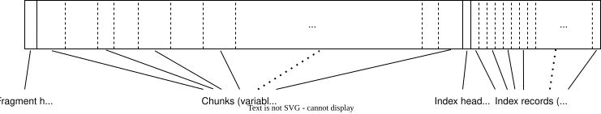
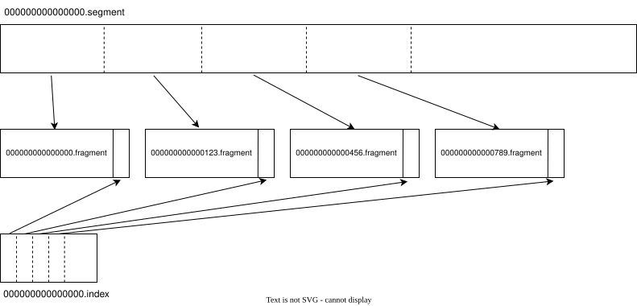

# `rabbitmq-stream-s3`

`rabbitmq-stream-s3` provides tiered storage for RabbitMQ streams using Amazon S3 as the remote tier to provide bottomless stream storage.

At a high level, this plugin replicates stream data from local `.segment` and `.index` files to S3 once the data becomes committed. Stream data can then be read either out of the local tier (if available) or the remote tier.

This document discusses the current design. This design is not set in stone and this document will change in the future.

### Glossary

* [**Osiris**](https://github.com/rabbitmq/osiris): The library providing the streaming subsystem used by RabbitMQ.
* **Stream**: Ordered, immutable, append-only sequence of records that can be truncated based on retention settings but cannot be compacted.
* **Record**: The smallest unit of user data in a stream, corresponding to individual messages published to RabbitMQ.
* **Entry**: Either a single record (simple entry) or a batch of possibly compressed records (batched entry from RabbitMQ Streams Protocol).
* **Offset**: Unique incrementing integer that addresses each record in the log, allowing consumers to start reading from any arbitrary position.
* **Chunk**: Batched and serialized entries written to the log, serving as the unit of replication in Osiris. Contains header with metadata including chunk type, offset, epoch, timestamp, checksum, and bloom filter.
* **Writer**: Leader member within a cluster which accepts entries from clients, batches them into chunks, and writes them to the local log.
* **Commit Offset**: The offset of the latest chunk which has been successfully replicated to a majority of nodes, identical to Raft's committed index concept.
* **Epoch**: Monotonically increasing number similar to Raft terms, incremented with each successful writer election. Used for truncating uncommitted data when a writer is deposed.
* **Replica**: Follower nodes that copy chunks from the writer to produce identical on-disk logs. The median offset across writer and replicas determines the commit offset.
* **Segment File**: On-disk file (`<offset>.segment`) containing a sequence of chunks. The filename offset indicates the first chunk's offset in the segment.
* **Index File**: Companion file (`<offset>.index`) to a segment file with fixed-size records tracking each chunk's offset, timestamp, epoch, byte position in segment, and chunk type.
* **Segment Rollover**: Process of closing current segment and index files and creating new ones when limits are reached (default: 500 MB or 256,000 chunks). Segment rollover also triggers writing a tracking snapshot and evaluating retention (see below).
* **Tracking Data**: Information about producers and consumers used for message deduplication and server-side consumer offset tracking. Segment files start with a tracking snapshot chunk and then use tracking deltas for edits to the data within a segment.
* **Acceptor**: Log access mode used by replicas to accept chunks replicated from the writer.
* **Data Reader**: Log access mode used on the writer node to send chunks to acceptors during replication.
* **Offset Reader**: Log access mode used by consumers to read from a replica starting at a specified offset spec.
* **Offset Spec**: A description of where an offset reader should attach to the log for reading. For example first attaches at the head, last at the tail, next for the next message after the tail. Offset specs may also be arbitrary offsets or timestamps of records in the stream.
* **Manifest**: A data structure describing each stream. The manifest holds information necessary for retention like total stream size and oldest timestamp, and is used by offset and data readers to find exact positions of chunks within the stream.
* **Retention**: Configurable rules (max age, max size, or both) that determine when oldest segments are truncated from the stream. Evaluating retention involves finding the oldest segments which can be deleted to satisfy the retention rules.

## Stream data representation

### Local-tier storage

This plugin does not change the on-disk storage of stream data used by Osiris. Stream data is stored in a `stream/` directory under RabbitMQ's data directory by default.

```
data/
├── stream/
│   ├── __stream-01_1745252105682952932/      // directory for stream named "stream-01" on default vhost
│   │   ├── 00000000000000000000.index        // first index file
│   │   ├── 00000000000000000000.segment      // first segment file
│   │   ├── 00000000000026061613.index        // second index file starting at offset 26061613
│   │   ├── 00000000000026061613.segment      // second segment file starting at offset 26061613
│   │   ├── 00000000000052132876.index        // second index file starting at offset 52132876
│   │   └── 00000000000052132876.segment      // second segment file starting at offset 52132876
│   ├── __stream-02_1745252105720074141/      // directory for stream named "stream-02" on default vhost
│   │   └── ..
│   ├── my-vhost_foo_1745253455243785338/     // directory for stream named "foo" on vhost "my-vhost"
│   │   └── ..
```

Each stream uses a directory under the `stream/` directory in the format `{vhost}_{stream-name}_{created-timestamp}`. Messages published to streams are stored in segment files. Segment files are named with the offset of the first entry in the segment. Messages are batched together by the writer process into chunks and appended to the latest segment file. Once the segment file exceeds a max size or a max number of chunks, the segment is closed and a new one is opened. Every segment has a corresponding index file with the same offset. The index file contains a small record for each chunk in the segment with metadata like the offset, timestamp, and byte offset of the chunk within the segment file. The default max size of a segment file is 500 MB. The size of the index depends on the number of chunks in the segment file. Publishing at high throughput results in smaller index files since there are fewer, larger chunks.

Segment and index files are identical between cluster members of a stream. All records are send to a writer member which writes the records as chunks. Any number of replica members then replicate the chunks from the writer's log. When a majority of members have written a chunk, publishers receive confirms that their messages have been written and the messages may then be read by consumers. Cluster membership, epoch numbers and writer/replica roles are decided by a Raft system.

### Remote-tier storage

`rabbitmq-stream-s3` uploads committed stream data to the remote tier aggressively to make local-tier data redundant quickly. In order to upload more aggressively, `rabbitmq-stream-s3` uses a different data representation in the remote tier.

### S3 bucket layout

`rabbitmq-stream-s3` uses one S3 bucket per cluster. The remote tier uses one [prefix](https://docs.aws.amazon.com/AmazonS3/latest/userguide/using-prefixes.html) per stream similar to the local tier's use of directories. Under this prefix there prefixes `data` to store stream data like segment and index file contents, and `metadata` to store tracking information used for consumers and retention.

<!-- NOTE: it would be easy to also support multi-tenant buckets by adding config for a prefix to use within a bucket. We wouldn't use this feature ourselves though. -->

```
rabbitmq/
├── stream/
│   ├── __stream-01_1745252105682952932/
│   │   ├── data/
│   │   │   └── ...      // segment and index data
│   │   └── metadata/
│   │       └── ...      // manifest data
```

### Fragments

The data representation between the local and remote tiers are separate. The local tier contains segment and index files while the remote tier contains smaller objects called _fragments_ which concatenate smaller sections of segment and index data together. Where a segment file typically reaches 500 MB, fragments store a smaller section of a segment around 64 MB of chunk-aligned segment data and their accompanying records from the index file. NOTE: the 64 MB figure will be tuned in testing. We expect a size in the range of 10 MB - 128 MB to be ideal.





Fragments start with a header, contain a sequence of one-or-more chunks and then contain the index header, a sequence of index records and finally a trailer. The trailer contains metadata like pointers to the beginning of the index within the fragment, the fragment's sequence number and offset into the segment file, offset of the next fragment, etc..

```
rabbitmq/
├── stream/
│   ├── __stream-01_1745252105682952932/
│   │   ├── data/
│   │   │   ├── 00000000000000000000.fragment
│   │   │   ├── 00000000000000001234.fragment
│   │   │   ├── 00000000000000005678.fragment
│   │   │   └── ...
│   │   └── metadata/
│   │       └── ...
```

Uploading fragments of segment and index files means that committed data can be uploaded more aggressively - once a fragment of data becomes committed - and uploads within a segment can be done in parallel for better network utilization.

## Manifest

The _manifest_ is a data structure which tracks the data stored in the remote tier for each stream. The manifest's design and operations are covered in the [manifest](./manifest.md) doc.

## Operations

### Writing

`rabbitmq-stream-s3` starts a [`gen_server`] called `rabbitmq_stream_s3_server` to coordinate tasks for all writing-related activity for streams on the local node. This server tracks each local stream and kicks off tasks to perform uploads and deletions. This server runs entirely in the background and does not interfere with the startup of writer or replica processes (for example no blocking calls during startup).

#### Publishing

The implementation of the `osiris_log_manifest` behaviour (`rabbitmq_stream_s3_log_manifest`) receives notifications when a chunk is written and when a segment file is rolled over by the `osiris_writer`. It tracks the metadata about the chunk like the segment's offset, first offset and timestamp, next chunk's offset, total size, etc.. When enough chunks have been published or when a segment file is rolled over, `rabbitmq_stream_s3_log_manifest` notifies `rabbitmq_stream_s3_server` that a fragment is available for upload. The server then kicks off a task to upload the section of the segment and index files for this fragment to a fragment object in the remote tier. This task then notifies `rabbitmq_stream_s3_server` when the upload is complete.

`rabbitmq_stream_s3_server` tracks completed uploads and when a _run_ of fragments has been uploaded, the server applies the fragment info to its in-memory copy of the manifest and uploads the new copy of the manifest to the remote tier. A set of fragments is a run when the next offset of each fragment is equal to the first offset on the next fragment - the fragments are in sequence without any gaps between them. Uploads for the manifest are debounced to avoid high-frequency updates during high throughput publishing.

Also see the [manifest documentation](./manifest.md#operations) for details about metadata changes from publishing and retention.

#### Stream deletion

`rabbitmq-stream-s3` leverages [the data stored in Khepri](#concurrency-control) to automatically kick off tasks to delete stream data from the remote tier. The `rabbitmq_stream_s3_db` module covers the plugin's interactions with Khepri. When storing data in Khepri, `rabbitmq_stream_s3_db` sets a Khepri _keep-while condition_ that ties together the lifetime of the entry for the stream ID with the stream queue's metadata. When the stream queue is deleted from the metadata store, the plugin's data for the stream ID is automatically deleted as well. `rabbitmq_stream_s3_db` also sets a Khepri _trigger_ on the stream ID path of the tree which watches for deletions of those tree nodes and executes a _stored procedure_. The stored procedure kicks off a task to perform the deletion of remote tier objects.

For more details about keep-while conditions, triggers and stored procedures, see the [Khepri overview documentation](https://hexdocs.pm/khepri/).

NOTE: the details of this section might change in the future but we plan to rely on Khepri triggers regardless.

### Reading

The `rabbitmq_stream_s3_log_reader` module implements `osiris_log_reader`. This reader uses local data when possible and reads older data from the remote tier. Readers start at a chosen offset spec. For offset specs which access the stream tail (`next` and `tail`), `rabbitmq_stream_s3_log_reader` delegates to the local tier. For other specs like arbitrary offsets, timestamps, or the stream head, `rabbitmq_stream_s3_log_reader` fetches the manifest from the local `rabbitmq_stream_s3_server`. To find offsets and timestamps, the reader then performs binary search on the manifest's array of entries. If the target entry is a group, then the reader downloads the group object and recursively continues the search within. Once the reader finds the fragment, it downloads the index section from the end of the fragment object and further binary searches within the index array to find an exact position within the fragment object.

Once the reader has a fragment object and byte offset within, it starts a [`gen_server`] which performs byte range requests within the object to cache data for offset reader to read. As the reader works forward in the stream data, this reader `gen_server` downloads more data with byte range requests. By prefetching aggressively enough, the reader can approach near-local-tier throughput at the cost of memory usage.

[`gen_server`]: https://www.erlang.org/docs/28/apps/stdlib/gen_server.html
