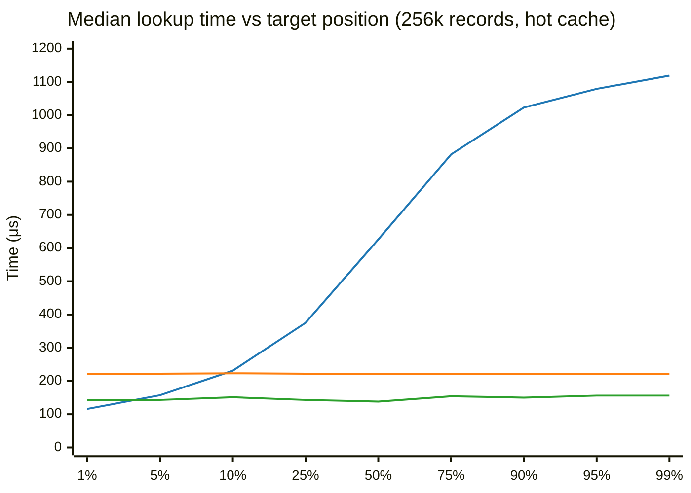
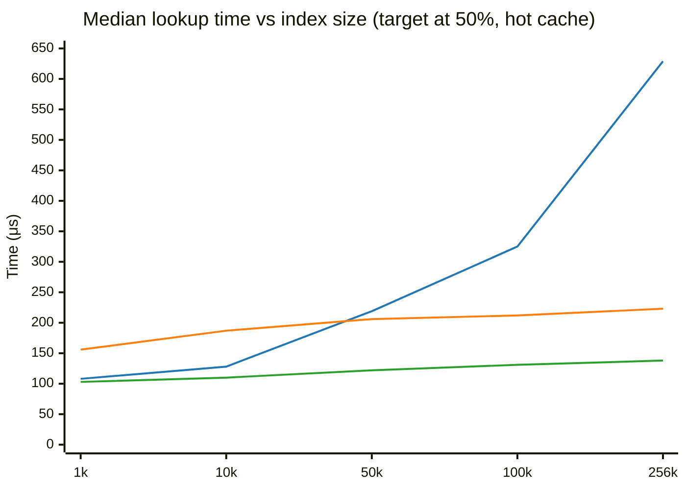
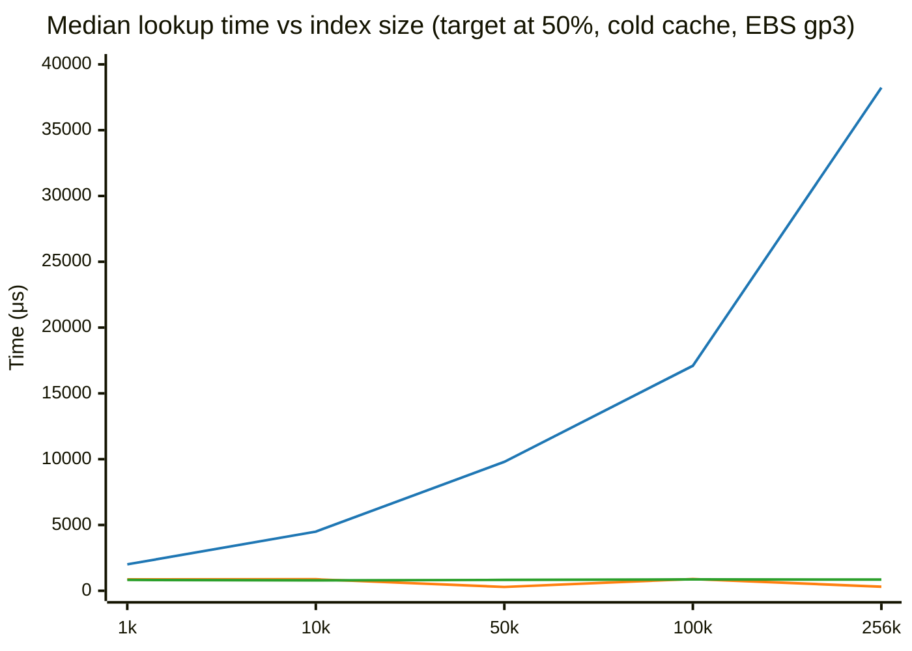

# Index Lookup: Block Binary Search

> Status update (2026-06-25). The block binary search proposed here was merged upstream (rabbitmq/osiris#219) and is now the production algorithm for single-offset and timestamp resolution at consumer attach (`osiris_log:offset_idx_scan`, `chunk_location_for_timestamp`). Skip search (described below as "the current algorithm") remains in osiris but only for multi-offset sampling, not the attach path this investigation analyzes. The benchmarks and analysis below remain valid and are kept for reference.

This investigation looks at optimizing the approach which Osiris uses to search through index files.

The Osiris index file has one 29-byte record per chunk. Each record contains the chunk's first offset, timestamp, epoch, file position, and type. The file has an 8-byte header followed by records in append order. At the default chunk limit of 256,000 per segment, the index is at most ~7.08 MiB.

Consumers resolve offset specs (a specific offset, a timestamp, `first`, `last`) by searching the index file for the relevant chunk. This happens once per consumer attach.

## The current algorithm: skip search

Skip search jumps forward 2048 records at a time, peeks at the key field, and when the target is overshot, bulk-reads the last 2048-record block and linear-scans it.

Complexity: O(n/B) block-boundary probes + O(B) linear scan, where B = 2048.

Introduced in [rabbitmq/osiris#195](https://github.com/rabbitmq/osiris/pull/195) to replace a per-record linear scan. That PR showed 48-81x improvement over the old approach.

## Block binary search

Binary search over block boundaries to find the target block (O(log2(n/B)) probes), then a single bulk read and linear scan within that block (O(B)).

At 256k records: 7 probes to find the block, one 58 KiB read, one linear scan. Total complexity is O(log n) with a cache-friendly final step.

## Benchmarks

Measured on AWS `m7g.large` (Graviton3, fixed clock frequency, CPU pinned to core 0). Benchee with 2s warmup, 10s measurement per scenario.

### Hot cache: position sweep at 256k records

Blue: skip_search. Orange: binary_search. Green: block_binary_search.

Skip search degrades linearly with position. Binary search is flat at ~222 μs. Block binary search is flat at ~138-156 μs, consistently 1.5x faster than binary search.

Data table

| Position | skip_search | binary_search | block_binary_search |
|---------:|------------:|--------------:|--------------------:|
| 1% | **116 μs** | 222 μs | 143 μs |
| 5% | 157 μs | 222 μs | **143 μs** |
| 10% | 231 μs | 223 μs | **151 μs** |
| 25% | 375 μs | 222 μs | **143 μs** |
| 50% | 626 μs | 221 μs | **138 μs** |
| 75% | 882 μs | 222 μs | **154 μs** |
| 90% | 1,023 μs | 221 μs | **150 μs** |
| 95% | 1,079 μs | 222 μs | **156 μs** |
| 99% | 1,119 μs | 222 μs | **156 μs** |

### Hot cache: size sweep at 50% position

Blue: skip_search. Orange: binary_search. Green: block_binary_search.

Block binary search wins at every size.

Data table

| Records | skip_search | binary_search | block_binary_search |
|--------:|------------:|--------------:|--------------------:|
| 1,000 | 108 μs | 156 μs | **103 μs** |
| 10,000 | 128 μs | 187 μs | **110 μs** |
| 50,000 | 219 μs | 206 μs | **122 μs** |
| 100,000 | 325 μs | 212 μs | **131 μs** |
| 256,000 | 629 μs | 223 μs | **138 μs** |

### Cold cache: size sweep at 50% position (EBS gp3)

Blue: skip_search. Orange: binary_search. Green: block_binary_search.

Cold cache on EBS: binary search and block binary search are comparable (both sub-millisecond). Skip search is catastrophic (up to 38 ms). Binary search wins at larger sizes because EBS can serve 18 small random reads faster than one 58 KiB sequential read due to striping.

Data table

| Records | skip_search | binary_search | block_binary_search |
|--------:|------------:|--------------:|--------------------:|
| 1,000 | 2,008 μs | 871 μs | **825 μs** |
| 10,000 | 4,497 μs | 875 μs | **794 μs** |
| 50,000 | 9,798 μs | **290 μs** | 826 μs |
| 100,000 | 17,097 μs | **893 μs** | 861 μs |
| 256,000 | 38,228 μs | **305 μs** | 855 μs |

## Why not classic binary search?

Binary search is the textbook answer for searching a sorted array. We benchmark it as a baseline to answer the obvious question: "why not just use binary search?"

Binary search does O(log2 n) probes, each a separate `pread` syscall reading 29 bytes at a computed position. At 256k records that is 18 probes. It has no position-dependent degradation and is simple to implement.

It loses to block binary search because of syscall overhead. Both algorithms do the same O(log2(n/B)) work to identify the right block. But binary search then continues narrowing with 11 more individual `pread` calls, while block binary search issues one bulk read of 58 KiB and scans in memory. The single bulk read is cheaper than 11 syscalls, and the sequential scan benefits from CPU cache prefetching.

On EBS with cold cache, binary search is competitive or faster because EBS can serve many small random reads in parallel (striping across multiple physical volumes). This is specific to network-attached storage. On local NVMe or with hot page cache, block binary search wins.

## Why skip search loses

Its coarse phase is linear: up to 125 block-boundary probes at 256k records. Each is a `pread` syscall. At 50% position that's ~62 syscalls before finding the right block.

## Offset vs timestamp semantics

The two search modes return different bounds:

- **Offset**: last chunk with ID ≤ target (consumer needs the chunk containing the offset).
- **Timestamp**: first chunk with timestamp ≥ target (consumer needs the earliest chunk at or after that time).

Block binary search handles both. The block-level search is identical. Only the linear scan within the block differs in termination condition.

## Relevance to this plugin

The local tier's index lookup is what consumers hit when resolving offset specs on segment files. It is also the transition point when a remote reader catches up to local data. The remote tier uses in-memory binary search on downloaded fragment indexes, which is unaffected by this change.

## Full results

This [GitHub Gist](https://gist.github.com/the-mikedavis/032848704b3a178e8d7d96b971bb4ab6) captures the full results and scripts for performing the tests.

The block binary search approach was submitted upstream as [rabbitmq/osiris#219](https://github.com/rabbitmq/osiris/pull/219).
