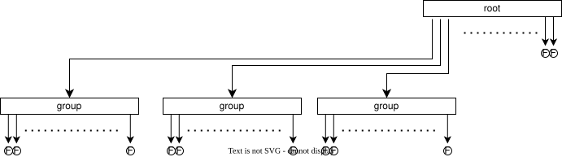
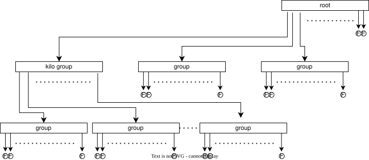

# Manifest

This doc is for developers who need to understand how the plugin tracks data in S3. After reading it you will know: the tree structure, the binary entry format, how rebalancing works, and how concurrent writers are handled safely.

The _manifest_ is a tree structure represented by objects in S3. A small number of these objects are also cached in memory by all stream members to enable fast access and modifications. Each stream has its own manifest. The manifest is tracked for two purposes:

* **Resolving offset specs**: consumers may start reading a stream from a requested offset or timestamp. The manifest must provide cheap lookup to find the fragment which contains a requested offset or timestamp.
* **Retention**: when a stream grows larger than its configured max-bytes or fragments become older than the configured max-age, the fragments should be deleted from the remote tier. The manifest should track enough metadata about each fragment so that determining this information by expensive remote-tier queries is unnecessary.

## Data structure

### Metadata array

At a high level, the manifest tracks a sorted array of metadata about every fragment in the stream. We can imagine the manifest like so:

```jsonc
{
  "total_size": 75753861427,
  "entries": [
    {"first_offset": 0, "first_timestamp": "2026-01-26T04:30:00Z", "last_timestamp": "2026-01-26T05:00:00Z", "size": 64000000},
    {"first_offset": 123456, "first_timestamp": "2026-01-26T05:00:00Z", "last_timestamp": "2026-01-26T05:30:00Z", "size": 65000000},
    {"first_offset": 234567, "first_timestamp": "2026-01-26T05:30:00Z", "last_timestamp": "2026-01-26T06:00:00Z", "size": 63000000},
    // ...
  ]
}
```

_JSON is just for display - the actual manifest uses a compact binary representation. See the [Representation section](#representation) below._

As new objects are uploaded, they are appended to the array in ascending order. This array can be quickly binary searched to find a given offset or timestamp. And we can quickly check the head of the array to see if max-age retention should delete the first fragment. We could also track the total size of the stream alongside this array to make max-bytes retention quick. The offset metadata about a fragment acts as a kind of pointer - the offset plus stream ID gives us enough information to create the fragment object's key.

The problem with a single array is how it grows in size as the stream gets longer. If each entry cost 34 bytes (8 byte offset, two 8 byte timestamps, 1 byte kind, 5 bytes size, 4 bytes UID), a 50 TB stream would have an array size around 28 MB. While this doesn't sound like much for a very large stream, this array must be kept in memory for access and modifications. Megabyte size objects become expensive in terms of memory and network bandwidth footprint.

### Factoring out groups

Streams are typically accessed near the tail (most recently written data). We can factor out the oldest `m` entries in the array into a new object called a _group_, replacing their array entries in the root with metadata about the group. This naturally keeps the root array and the group arrays sorted, so we can continue to binary search. We can't easily find the oldest timestamp, though, so we can track that on the root object.

```jsonc
{
  // Root-level metadata to track to make retention cheap:
  "oldest_last_timestamp": "2026-01-26T05:00:00Z",
  "total_size": 75753861427,
  // Then the root array:
  "entries": [
    {"kind": "group", "first_offset": 0, "first_timestamp": "2026-01-26T04:30:00Z", "last_timestamp": "2026-01-30T05:00:00Z"},
    {"kind": "group", "first_offset": 12354168, "first_timestamp": "2026-01-30T05:00:00Z", "last_timestamp": "2026-02-02T05:00:00Z"},
    {"kind": "fragment", "first_offset": 23465279, "first_timestamp": "2026-02-02T05:00:00Z", "last_timestamp": "2026-02-02T05:30:00Z", "size": 65000000},
    // ...
  ]
}
```

With this layout we update the root-level information necessary for retention and avoid storing metadata about all fragments. Only the oldest `m` fragments are factored out into groups, so recently written stream data is always accessible at the end of the entries array. To lookup older data we first determine which group object to search, then download the group object and search within.

Manifests of small streams only have a root object which points directly to fragments.


Larger streams have the earliest sections of the array factored out into groups.



### Kilo-groups and mega-groups

To support practically infinitely long streams, we can factor out `m` groups into a kilo-group. And once we have `m` kilo-groups, they can be refactored out into a mega-group. This recursive 'factoring out' makes a tree structure which can support a very high capacity with a low memory footprint and quick search.



### Choosing `m`

An `m` which is too small increases the number of requests to the remote tier during factoring and search, but reduces memory footprint. And vice versa for an `m` which is too large. We're using `1024` as a nice round power of two, though this could be tuned in the future. With `m=1024` and 34 bytes for each array entry, each (kilo-/mega-)group object only takes ~34 kiB, which is small enough to fit into memory comfortably even when there are many streams. The root can grow beyond this, but remains small anyways. Small streams (less than 1024 fragments) do not need any groups at all and can store all metadata in the root. If `m=1024` and mega-groups are the largest kind of group, a 'fully loaded' root of 1024 mega-groups points to 1024^4 fragments. At an average fragment size of 64 MiB this covers 70 EiB of data in a single stream, which is a large enough amount that publishing it is very difficult in the first place.

A large `m` makes lookup fast. With mega-groups being the largest kind of group, lookup within even EiB of data would make 3 round-trips to the remote tier to determine the fragment for a given offset or timestamp. The root is cached, then one round trip gets the mega-group, another gets the right kilo-group, another gets the right group and then search within that group finds the right fragment. If the remote tier has reasonably low latency (10-100ms) then lookup is always sub-second.

### Complexity

`n` is the length of a stream.

| Characteristic                        | Complexity | Notes
|---                                    |---         |---
| Space                                 | O(n)       | The manifest tracks all fragments uploaded for a stream. The oldest objects are deleted when the oldest fragments in the stream are deleted by retention.
| Memory footprint                      | O(1)       | The tree's root is held in memory. The root has an upper bound on size and factoring out groups keeps the practical size small. The first group may also be cached in memory to make repeated retention evaluations cheaper.
| Lookup (offset/timestamp resolution)  | O(log(n))  | The tree structure makes descending from object to object cheap. Each manifest object is sorted by offset/timestamp ascending, so offsets/timestamps can be found within objects with binary search. Lookups of older data take longer while lookup of recently-written data is cheaper.
| Calculate total stream size           | O(1)       | Total size is stored in the manifest root and updated gradually as fragments are added or removed from the manifest.
| Find oldest fragment's last timestamp | O(1)       | Oldest fragment's last timestamp is also tracked in the root and is updated when retention removes fragment(s).

### Representation

Manifest objects are serialized in a custom binary format to minimize memory and network footprint. This representation is not guaranteed to be stable - it might change over time. Stream readers should rely on RabbitMQ to read and write these objects instead of interacting with the remote tier objects directly.

<details><summary>Root...</summary>

```
|0              |1              |2              |3              | Bytes
|0 1 2 3 4 5 6 7|0 1 2 3 4 5 6 7|0 1 2 3 4 5 6 7|0 1 2 3 4 5 6 7| Bits
+---------------+---------------+---------------+---------------+
| Manifest magic (0x4f534952 = "OSIR")                          |
+---------------------------------------------------------------+
| Manifest version (0x00000001)                                 |
+---------------------------------------------------------------+
| First offset (u64)                                            |
|                                                               |
+---------------------------------------------------------------+
| Next offset (u64)                                             |
|                                                               |
+---------------------------------------------------------------+
| First timestamp (i64)                                         |
|                                                               |
+---------------------------------------------------------------+
| First-last timestamp (i64)                                    |
|                                                               |
+----+----------------------------------------------------------+
+ 0  + Total size (u70)                                         |
+----+                                                          |
|                                                               |
|               +-----------------------------------------------|
+---------------+                                               |
| Contiguous list of entries                                    |
: (until EOF)                                                   :
:                                                               :
+---------------------------------------------------------------+
```

---

</details>

<details><summary>Array entries...</summary>

Fragment and group entries share the same 34-byte layout, differentiated by the `Kind` field:

```
|0              |1              |2              |3              | Bytes
|0 1 2 3 4 5 6 7|0 1 2 3 4 5 6 7|0 1 2 3 4 5 6 7|0 1 2 3 4 5 6 7| Bits
+---------------+---------------+---------------+---------------+
| First offset (u64)                                            |
|                                                               |
+---------------------------------------------------------------+
| First timestamp (i64)                                         |
|                                                               |
+---------------------------------------------------------------+
| Last timestamp (i64)                                          |
|                                                               |
+---------------+-----------------------------------------------+
| Kind (u8)     | Size (u40)                                    |
+---------------+                                               |
|               +-----------------------------------------------+
+---------------+-----------------------------------------------+
| UID (u32)                                                     |
+---------------------------------------------------------------+
```

**Kind** (1 byte): identifies the entry type.
- `0x00` = fragment
- `0x01` = group
- `0x02` = kilo-group
- `0x03` = mega-group

**Size** (5 bytes, u40): total byte size of the fragment's data. Supports up to 1 TiB per fragment. Zero for group/kilo-group/mega-group entries.

**UID** (4 bytes, u32): random identifier included in the S3 object key. Prevents overwrites when competing writers upload to the same offset range. Formatted as 8 lowercase hex characters in keys.

---

</details>

<details><summary>Group...</summary>

A group object has the same 49-byte header layout as the root. The magic differs by kind (`"OSIG"` for a group, `"OSIK"` for a kilo-group, `"OSIM"` for a mega-group), and the next-offset, first-last-timestamp, and total-size fields are written as zero for group objects.

```
|0              |1              |2              |3              | Bytes
|0 1 2 3 4 5 6 7|0 1 2 3 4 5 6 7|0 1 2 3 4 5 6 7|0 1 2 3 4 5 6 7| Bits
+---------------+---------------+---------------+---------------+
| Group magic ("OSIG" / "OSIK" / "OSIM")                        |
+---------------------------------------------------------------+
| Group version (0x00000001)                                    |
+---------------------------------------------------------------+
| First offset (u64)                                            |
|                                                               |
+---------------------------------------------------------------+
| Next offset (u64, written as 0)                               |
|                                                               |
+---------------------------------------------------------------+
| First timestamp (i64)                                         |
|                                                               |
+---------------------------------------------------------------+
| First-last timestamp (i64, written as 0)                      |
|                                                               |
+----+----------------------------------------------------------+
+ 0  + Total size (u70, written as 0)                           |
+----+                                                          |
|                                                               |
|               +-----------------------------------------------|
+---------------+                                               |
| Contiguous list of entries                                    |
: (until EOF)                                                   :
:                                                               :
+---------------------------------------------------------------+
```

---

</details>

## Operations

When the next fragment of stream data has been successfully uploaded, the remote replica reader appends the fragment's metadata to its in-memory copy of the root and evaluates whether the root has grown too large. The remote replica reader debounces uploads of the updated root to the remote tier to keep requests-per-second low. Once the root is too large, it uploads a new group object and once that has been successfully uploaded, replaces the fragments in its cached copy of the root with the new group's metadata.

Periodically the remote replica reader evaluates whether the stream's retention rules should delete fragments. If the root has no groups, it decides which fragments to delete and removes them from the root array. The actual S3 object deletions are deferred until the manifest persist that records their removal succeeds, so a reader never sees a manifest that still references an already-deleted object (issue #166). If there are groups, it downloads the first group object and evaluates retention against the fragments within. Once that process completes, it updates the total-size and oldest-last-timestamp metadata in the root. Group objects are never updated after being written, but once all fragments pointed to by a group (or all groups pointed to by a kilo-group, etc.) are deleted, the group object is deleted and removed from the root.

Changes to the manifest are made only by the remote replica reader on the stream writer's node. Nodes with replica copies receive metadata about changes to each manifest through a generic edit type which can express the three kinds of changes: 1/ appending new fragments, 2/ factoring out groups and 3/ changes caused by retention. Since all stream members know information about the data in the remote tier, all members can perform local retention to evict fully uploaded segments aggressively.

### Rebalancing

When the root's entries array accumulates `rebalance_threshold` (default 1024) entries of the same kind, the oldest entries are factored into a group object of the next-higher kind (fragments into a group, groups into a kilo-group, kilo-groups into a mega-group).

The rebalance lifecycle:

1. After fragment completions are applied to the in-memory manifest, the core scans the entries array for runs of entries exceeding the threshold.
2. If detected, the core emits an `{upload_group, ...}` effect and sets `rebalance_in_flight = true`. Persist is deferred while a rebalance is in flight.
3. The shell spawns a task that PUTs the group object to S3. Group uploads bypass the governor (they are small, ~34 KiB, and on the critical path for the persist).
4. On completion, the core applies the rebalance edit: replaces the factored-out entries with a single group entry in the root.
5. The core checks recursively: if the replacement created enough group entries to exceed the threshold at the next level, another rebalance is triggered (group into kilo-group, etc.).
6. Once no more rebalancing is needed, persist proceeds normally.

If the group upload fails with a retriable error (500, 503, timeout), the effect is re-emitted immediately. If it fails with a fatal error, the rebalance is abandoned: `rebalance_in_flight` is cleared and persist proceeds with the oversized root. The next fragment completion cycle re-detects the threshold and tries again. Abandoning a rebalance is always safe because the manifest is correct either way.

### Retention within groups

Group objects are immutable. Retention does not rewrite them. Instead, retention deletes fragment objects referenced by the group and updates the root's metadata to reflect what data is actually available.

When the first entry in the root is a group:

1. Download the group object to inspect its fragment entries.
2. Evaluate the retention policy (max-bytes, max-age) against those entries.
3. Delete expired fragment objects via the reaper.
4. If all fragments in the group are expired: remove the group entry from the root and delete the group object.
5. If partially expired: leave the group entry in place but update the root's `first_offset`, `first_timestamp`, and `total_size` to reflect the oldest surviving fragment.

The manifest's `first_offset` is the authoritative marker for "oldest available data." Readers (via the fragment iterator) use this to skip deleted entries when descending into groups. The iterator positions itself at the first entry whose offset is at or above `first_offset`, avoiding 404s on fragments that retention has already cleaned up. This works recursively through kilo-groups and mega-groups.

### Resolving the manifest

When a writer starts up for a stream, the remote replica reader downloads the manifest root from the remote tier to determine what local data needs to be uploaded. It compares the manifest's `next_offset` against the local log to determine where to begin uploading. If the remote tier is ahead of the local log (due to an epoch change or data directory reset), the remote replica reader truncates the manifest to match the local log.

## Concurrency control

A network partition might elect a new leader on the majority side while a deposed writer continues running on the minority side. Both writers might have access to S3, so both writers may modify the manifest. `rabbitmq-stream-s3` uses an [optimistic concurrency control](https://en.wikipedia.org/wiki/Optimistic_concurrency_control) to avoid conflicting writes. Keys of all metadata objects include a unique identifier string (UID). In practice the metadata directory looks like this:

```
rabbitmq/
├── stream/
│   ├── __stream-01_1745252105682952932/
│   │   ├── data/
│   │   │   └── ...
│   │   └── metadata/
│   │       ├── 00000000000000000000.f619c087.kgroup
│   │       ├── 00000000000000000000.d078ceab.group
│   │       ├── 00000000000012345678.79425118.group
│   │       ├── 00000000000091234567.edabc41f.group
│   │       ├── ...
│   │       └── root.5.db868505.manifest   // the root, at epoch 5
```

The UID of the manifest root is stored in [Khepri](https://github.com/rabbitmq/khepri) (RabbitMQ's metadata store) associated with the stream name. The Khepri tree looks like this:

```
rabbitmq
├── rabbitmq_stream_s3
│   └── <<"__stream-01_1745252105682952932">>
│       Data: {Uid: db868505, Epoch: 5}. Version: 10
├── vhosts
│   └── <<"/">>
│       ├── queues
│       │   └── <<"stream-01">>
│       │       Data: ...
│       └── ...
└── ...
```

When updating the manifest, the remote replica reader first creates the manifest object in the remote tier. Because of the randomness in the UID, the new object can be written without conflict without any coordination. Then it updates the UID in Khepri with a conditional write: it sets a precondition that the current version of the Khepri tree node is the version it read. Khepri rejects the write if another writer has updated the tree node. When the precondition fails, the remote replica reader abandons the change, re-downloads the manifest and retries.

In the precondition, the remote replica reader also checks that the stored epoch is less than or equal to its epoch. Because epoch numbers are monotonically increasing and incremented for each new writer, this extra check causes a deposed writer's updates to fail once the newer writer has completed at least one update. The epoch check reduces the chance of a deposed writer interrupting a newer writer.

## Manifest edit replication

Replica nodes maintain a cached copy of the manifest so that consumers on any node can resolve offsets into the remote tier without contacting the writer. The writer propagates manifest changes to replicas via _edits_ rather than sending the full manifest on every change (manifests can be megabytes for large streams).

### Correctness invariant

**A replica's manifest must always be a contiguous prefix of the writer's edit history.** Edits must be applied in strict sequential order. Applying an edit out of order or skipping an edit would corrupt the replica's manifest (wrong entry positions, incorrect total_size, broken offset resolution).

This invariant is non-negotiable. Correctness takes absolute priority over the cost savings of incremental edits. If the invariant cannot be maintained (due to message loss, reordering, or crash), the replica must discard its cached manifest and re-sync the full manifest from the writer.

### Edit structure

An edit describes a modification to the manifest's entries array using three fields: `pos` (byte offset into the array), `len` (bytes to remove), and `entries` (bytes to insert). This single structure handles all manifest mutations:

- **Append** (new fragment uploaded): `pos = byte_size(entries_array)`, `len = 0`, `entries = <new entry>`. Appends to the end.
- **Truncate** (retention deletes oldest fragments): `pos = 0`, `len = N`, `entries = <<>>`. Removes a prefix.
- **Replace** (rebalancing factors fragments into a group): `pos = P`, `len = L`, `entries = <group entry>`. Splices a group pointer in place of the factored-out fragment entries.

An edit also carries updated top-level metadata (`first_offset`, `next_offset`, `first_timestamp`) and a signed `size` delta (added to the manifest's `total_size`; negative for retention) so the replica can update its manifest root without recomputing from the entries array.

### Edit ordering when rebalancing

A single persist may produce multiple edits: an append edit (new fragments) and a rebalance edit (replacing entries with a group pointer). These must be ordered correctly for replicas to apply them.

The append edit must come before the rebalance edit. A rebalance edit replaces entries at a byte position. Those entries must already exist in the replica's array for the replacement to be valid. The append edit creates them. If the rebalance came first, the replica would attempt to replace bytes that don't exist yet.

This ordering is non-obvious because the rebalance logically happened "before" the persist (the group was uploaded and the in-memory manifest was rewritten before persist started). But from the replica's perspective, it needs the entries to exist before they can be replaced.

### Sequence numbers

Each edit carries a monotonically increasing sequence number. The writer increments the sequence on every edit. Each replica tracks the last applied sequence number. On receiving an edit:

1. If `edit.seq == replica.seq + 1`: apply the edit, advance `replica.seq`.
2. Otherwise: the edit is out of sequence. Discard the local manifest and request a full re-sync from the writer.

There is no attempt to buffer or reorder edits. A single gap triggers a full re-sync. This is deliberate: the re-sync path is simple, correct, and bounded in cost (one manifest download). Attempting to recover from gaps with buffering adds complexity and failure modes.

### Why messages can be lost

Erlang distribution does not guarantee delivery. Messages between connected nodes are ordered but can be silently lost when the distribution connection drops (net split, node crash) because messages in the kernel send buffer are discarded without notification to the sender. The distribution buffer can also overflow under sustained load.

The sequence number mechanism detects these losses and triggers re-sync. Node monitors detect disconnections and remove the node from the broadcast set. When the node reconnects and re-registers, it receives the full current manifest (equivalent to a re-sync).

### Formal modeling

This protocol is formally verified in [`tla/manifest-replication/`](../tla/manifest-replication/). See [`tla/README.md`](../tla/README.md) for details and how to run the model checker.
