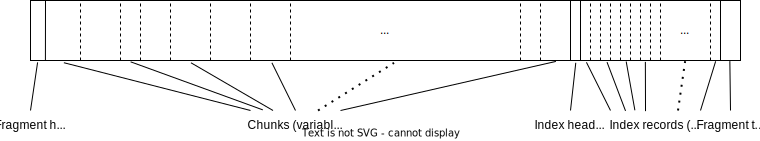
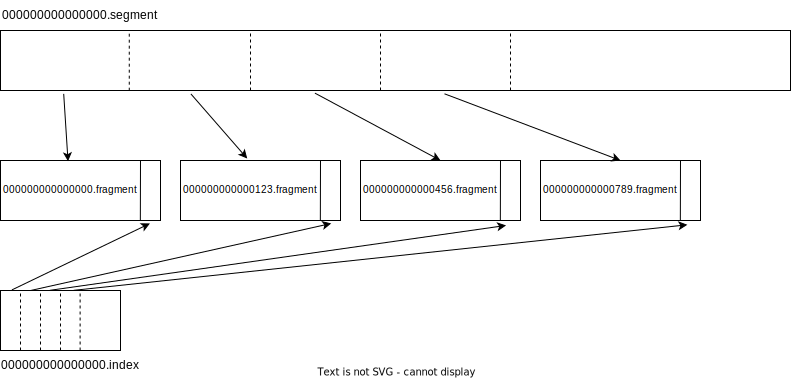
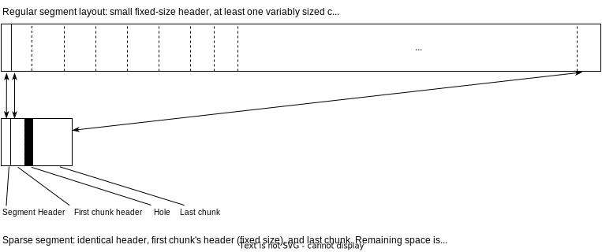
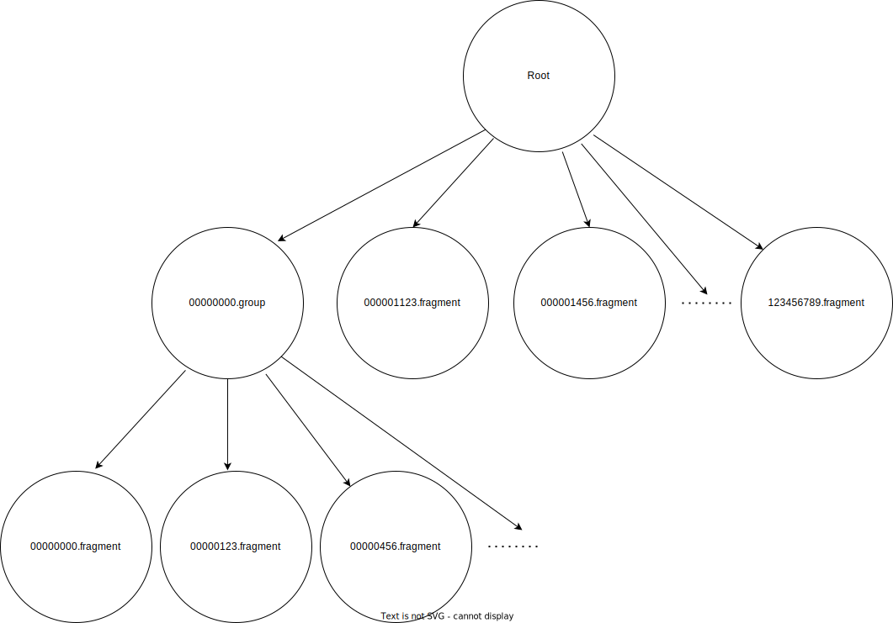

# `rabbitmq-stream-s3`

`rabbitmq-stream-s3` provides tiered storage for RabbitMQ streams using Amazon S3 as the remote tier to provide bottomless stream storage.

At a high level, this plugin uploads stream data from local `.segment` and `.index` files to S3 once the data becomes committed and immutable. Stream data can then be read either out of the local tier (if available) or the remote tier.

This document discusses the current design. This design is not set in stone and this document will change in the future.

### Glossary

* [**Osiris**](https://github.com/rabbitmq/osiris): The library providing the streaming subsystem used by RabbitMQ.
* **Stream**: Ordered, immutable, append-only sequence of records that can be truncated based on retention settings but cannot be compacted.
* **Record**: The smallest unit of user data in a stream, corresponding to individual messages published to RabbitMQ.
* **Entry**: Either a single record (simple entry) or a batch of possibly compressed records (batched entry from RabbitMQ Streams Protocol).
* **Offset**: Unique incrementing integer that addresses each record in the log, allowing consumers to start reading from any arbitrary position.
* **Chunk**: Batched and serialized entries written to the log, serving as the unit of replication in Osiris. Contains header with metadata including chunk type, offset, epoch, timestamp, checksum, and bloom filter.
* **Writer**: Leader member within a cluster which accepts entries from clients, batches them into chunks, and writes them to the local log.
* **Commit Offset**: The offset of the latest chunk which has been successfully replicated to a majority of nodes, identical to Raft's committed index concept.
* **Epoch**: Monotonically increasing number similar to Raft terms, incremented with each successful writer election. Used for truncating uncommitted data when a writer is deposed.
* **Replica**: Follower nodes that copy chunks from the writer to produce identical on-disk logs. The median offset across writer and replicas determines the commit offset.
* **Segment File**: On-disk file (`<offset>.segment`) containing a sequence of chunks. The filename offset indicates the first chunk's offset in the segment.
* **Index File**: Companion file (`<offset>.index`) to a segment file with fixed-size records tracking each chunk's offset, timestamp, epoch, byte position in segment, and chunk type.
* **Segment Rollover**: Process of closing current segment and index files and creating new ones when limits are reached (default: 500 MB or 256,000 chunks). Segment rollover also triggers writing a tracking snapshot and evaluating retention (see below).
* **Tracking Data**: Information about producers and consumers used for message deduplication and server-side consumer offset tracking. Segment files start with a tracking snapshot chunk and then use tracking deltas for edits to the data within a segment.
* **Acceptor**: Log access mode used by replicas to accept chunks replicated from the writer.
* **Data Reader**: Log access mode used on the writer node to send chunks to acceptors during replication.
* **Offset Reader**: Log access mode used by consumers to read from a replica starting at a specified offset spec.
* **Offset Spec**: A description of where an offset reader should attach to the log for reading. For example first attaches at the head, last at the tail, next for the next message after the tail. Offset specs may also be arbitrary offsets or timestamps of records in the stream.
* **Manifest**: A data structure describing each stream. The manifest holds information necessary for retention like total stream size and oldest timestamp, and is used by offset and data readers to find exact positions of chunks within the stream.
* **Retention**: Configurable rules (max age, max size, or both) that determine when oldest segments are truncated from the stream. Evaluating retention involves finding the oldest segments which can be deleted to satisfy the retention rules.

## Stream data representation

### Local-tier storage

This plugin does not change the on-disk storage of stream data used by Osiris. Stream data is stored in a `stream/` directory under RabbitMQ's data directory by default.

```
data/
├── stream/
│   ├── __stream-01_1745252105682952932/      // directory for stream named "stream-01" on default vhost
│   │   ├── 00000000000000000000.index        // first index file
│   │   ├── 00000000000000000000.segment      // first segment file
│   │   ├── 00000000000026061613.index        // second index file starting at offset 26061613
│   │   ├── 00000000000026061613.segment      // second segment file starting at offset 26061613
│   │   ├── 00000000000052132876.index        // second index file starting at offset 52132876
│   │   ├── 00000000000052132876.segment      // second segment file starting at offset 52132876
│   ├── __stream-02_1745252105720074141/      // directory for stream named "stream-02" on default vhost
│   │   ├── ..
│   ├── my-vhost_foo_1745253455243785338/     // directory for stream named "foo" on vhost "my-vhost"
│   │   ├── ..
```

Each stream uses a directory under the `stream/` directory in the format `{vhost}_{stream-name}_{created-timestamp}`. Messages published to streams are stored in segment files. Segment files are named with the offset of the first entry in the segment. Messages are batched together by the writer process into chunks and appended to the latest segment file. Once the segment file exceeds a max size or a max number of chunks, the segment is closed and a new one is opened. Every segment has a corresponding index file with the same offset. The index file contains a small record for each chunk in the segment with metadata like the offset, timestamp, and byte offset of the chunk within the segment file. The default max size of a segment file is 500 MB. The size of the index depends on the number of chunks in the segment file. When publishing with reasonably high throughput an index file might end up around 5-10 MB for a 500 MB segment.

Segment and index files are identical between cluster members of a stream. All records are written to a writer member. Any number of replica members then replicate chunks from the writer's log. When a majority of members have written a chunk, publishers receive confirms that their messages have been written and the messages may then be read by consumers. Cluster membership, epoch numbers and writer/replica roles are decided by a Raft system.

### Remote-tier storage

`rabbitmq-stream-s3` uploads committed stream data to the remote tier aggressively to make local-tier data redundant quickly. In order to upload more aggressively, `rabbitmq-stream-s3` uses a different data representation in the remote tier.

### S3 bucket layout

`rabbitmq-stream-s3` uses one S3 bucket per cluster. The remote tier uses one [prefix](https://docs.aws.amazon.com/AmazonS3/latest/userguide/using-prefixes.html) per stream similar to the local tier's use of directories. Under this prefix there prefixes `data` to store stream data like segment and index file contents, and `metadata` to store tracking information used for consumers and retention.

<!-- NOTE: it would be easy to also support multi-tenant buckets by adding config for a prefix to use within a bucket. We wouldn't use this feature ourselves though. -->


```
{bucket-name}/
├── {hash(stream-name)}_{vhost}_{stream-name}/
│   ├── data/
│   │   └── ...      // segment and index data
│   └── metadata/
│       └── ...      // manifest data
```

The prefix for each stream includes a consistent hash of the stream name at the beginning. This adds entropy to the key which reduces the chances of hitting [S3 throttles](https://docs.aws.amazon.com/AmazonS3/latest/userguide/optimizing-performance-design-patterns.html#optimizing-performance-high-request-rate).

### Fragments

The data representation between the local and remote tiers are separate. The local tier contains segment and index files while the remote tier contains smaller objects called _fragments_ which concatenate smaller sections of segment and index data together. Where a segment file typically reaches 500 MB, fragments store a smaller section of a segment around 64 MB of chunk-aligned segment data and their accompanying records from the index file. NOTE: the 64 MB figure will be tuned in testing. We expect a size in the range of 10 MB - 128 MB to be ideal.





Fragments start with a header, contain a sequence of one-or-more chunks and then contain the index header, a sequence of index records and finally a trailer. The trailer contains metadata like pointers to the beginning of the index within the fragment, the fragment's sequence number and offset into the segment file, offset of the next fragment, etc..

```
{bucket-name}/
├── {hash(stream-name)}_{vhost}_{stream-name}/
│   ├── data/
│   │   ├── 00000000000000000000.fragment
│   │   ├── 00000000000000001234.fragment
│   │   ├── 00000000000000005678.fragment
│   │   └── ...
│   └── metadata/
│       └── ...
```

Uploading fragments of segment and index files means that committed data can be uploaded more aggressively - once a fragment of data becomes committed - and uploads within a segment can be done in parallel for better network utilization.

### Sparse segment and index files

`rabbitmq-stream-s3` makes a minor modification to the local tier layout for replicas starting far behind on replication (for example new replicas). `rabbitmq-stream-s3` downloads the last chunk which was uploaded to the remote tier and uses information from the writer to produce _sparse_ versions of the current segment and index files. These sparse files are logically the same size as the actual segment and index files on other replicas and have just enough data to convince Osiris that the segment and index contents are valid. But sparse files have minimal file system footprint. For example, a [sparse file](https://en.wikipedia.org/wiki/Sparse_file) can be created in Erlang like so:

```erlang
> {ok, Fd} = file:open("sparse.bin", [write, raw, binary]).
> ok = file:write(Fd, <<"Hello, world!">>).
> {ok, _} = file:position(Fd, 50_000_000). %% Skip ahead to 50 MB
> ok = file:write(Fd, <<"Hello, world!">>).
```

```
$ du -h --apparent-size sparse.bin   # logical size
48M sparse.bin
$ du -h sparse.bin                   # actual size
8.0K sparse.bin
```

The file-system represents the hole in the middle with metadata instead of consuming actual disk space.

When replicating to a new member, the writer sends the log header and first chunk's header (56 bytes total) and the new replica downloads the last chunk in the last fragment uploaded to the remote tier and recreates its associated index record. This is enough information to create sparse segment and index files which are valid according to Osiris, but the actual disk footprint is minimal. Any reads from this replica start in S3 and can switch to reading from local files at the last chunk downloaded from S3.



Creating sparse segment and index files is complex but enables very cheap replication for new members. This provides very fast scale-in/scale-out even when moving a very large number of streams to new cluster members.

## Manifest

The manifest is a data structure or procedure for resolving offset specs. It also may provide useful information for retention like the oldest timestamp and current stream size. In the local tier the manifest is provided by the file system. Osiris lists the stream directory to find all index files and sorts them by offset. Osiris can efficiently find offset specs by finding the right index file and then scanning within the index file records to find a chunk's position.

The remote tier can hold practically infinite data, so the manifest needs a different format. The directory listing could be replaced with S3 LIST requests, but these are paginated by at-most 1000 entries. For especially large streams it can take tens of round trips to S3 to find the right fragment for an offset spec. Instead `rabbitmq-stream-s3` stores an M-way tree structure in the remote tier which can track very large numbers of fragments.

### How much data can the remote tier hold?

For some napkin math, publishing at a very very high throughput of 1 GB/sec to a single stream can publish a petabyte (PB) of data in a matter of days. An exabyte (EB) can be published in a hypothetically possible number of years (~32) and a zettabyte (ZB) would take an impossibly long time to publish. Publishing and retaining immense amounts of data like this is unlikely to happen in practice, but because storage in S3 is practically bottomless, the manifest should be able to handle these absurd sizes gracefully.

### M-way tree

The difficulty in tracking very large streams is the number of fragments. 1 PB of segment data at a fragment size of 64 MB would take 15,625,000 fragments to represent. To track very large numbers of fragments, `rabbitmq-stream-s3` stores a tree structure in the remote tier under each stream's `metadata` directory. Leaf nodes in this tree are records with metadata about a fragment: the offset, timestamp, file size, and sequence number within the segment. These records are individually very small - 27 bytes per fragment.

When a fragment is uploaded, a metadata record for it is appended to the array of records in the root node. Once the root node reaches a large number of records, the writer rebalances out a _group_ of fragments. Rebalancing puts the `M` oldest fragments under a new branch and replaces the records in the root's array with a new record which points to the group. A `{first-offset}.group` object is added to the metadata directory in S3 and then the manifest is overwritten with the rebalanced set of records. Rebalancing keeps the root node small so that downloads, manipulation, and uploads remain cheap. Rebalancing away the oldest `M` records biases for recent data. Following a branch means a round-trip to S3, so fragments in the root are always fastest to look up. For larger streams, once enough groups have been rebalanced, the root can further rebalance away `M` groups into a _kilo-group_. `M` kilo-groups could also be rebalanced away into a _mega-group_, but it's unlikely to happen in practice if `M` is large.



The branching factor will be tuned in testing but a relatively high value like `M=1024` provides a theoretically good balance. With 27 bytes of metadata per fragment, group files would take around 27 KiB to represent - small enough to be comfortably downloaded and searched in-memory. A high branching factor keeps the height of the tree low. With `M=1024` and fragments even as small as 1 MB, a lookup within the tree for one of the oldest fragments would take at-most four round-trips to S3: the root (cached), a kilo-group, a group, and the leaf (fragment). Within tree nodes, fragment metadata is naturally stored in ascending order of offset. This mitigates the high branching factor: binary search can be used on the record arrays to quickly find specific fragments or groups within each tree node.

```
{bucket-name}/
├── {hash(stream-name)}_{vhost}_{stream-name}/
│   ├── data/
│   │   └── ...
│   └── metadata/
│       ├── 00000000000000000000.kgroup   // kilo-group tracking M groups
│       ├── 00000000000000000000.group    // group tracking M fragments
│       ├── 00000000000012345678.group
│       ├── 00000000000091234567.group
│       ├── ..
│       └── root                          // root tracking the kilo-group, groups
│                                         // and recent fragments
```

### Eventual consistency

The writer keeps the root node cached in memory and it debounces updates to the root object to avoid excessive egress and throttling when a stream is published at high throughput. Replica nodes can ask the writer node to lookup an offset spec within the cached root, but even when the writer is not available, replicas can alternatively download an out-of-date manifest object from the remote tier for lookup. Fragments store the next fragment's offset in their trailer, so even when using an out-of-date copy of the manifest, a replica can find all fragments in the remote tier by following these "next pointers."
