# CPU impact of streaming

This doc is an investigation into CPU usage of streaming workloads. Streaming workloads stress network resources nearly more than anything else, and far more than messaging workloads. At relatively low message sizes, though, streaming can use up significant CPU resources.

## Test Setup

Single-node broker, `m7g.2xlarge` instances, single producer, no consumers, no retention policy. Three throughput levels tested.

We use two `m7g.2xlarge` instances, `bob` and `alice`. In this test `bob` runs RabbitMQ on main from the HEAD at time of writing, `267dec665112844d457464c30a35eb36d353eb88`, using Erlang/OTP 27.3.4.2. `alice` has passwordless SSH access to `bob`. `bob` has the plugins `rabbitmq_stream` and `rabbitmq_prometheus` enabled and a user provisioned for `alice` with username `alice` and password `password`. `bob` needs `pidstat` installed from the `sysstat` package. `alice` has a script `bench.sh` to run the test.

<details><summary><code>bench.sh</code> script...</summary>

```bash
#!/usr/bin/env bash
set -uo pipefail
# Note: -e intentionally omitted; we handle errors explicitly below.

# Usage: ./bench.sh <broker-host>
# Run from alice, targeting bob.

HOST="${1:?usage: $0 <broker-host>}"
URI="rabbitmq-stream://alice:password@${HOST}:5552"
DURATION=60
WARMUP=30
CHUNK_SAMPLE_WINDOW=$((DURATION - WARMUP - 5))
STREAM_PERF_TEST="java -jar $HOME/stream-perf-test.jar"
RESULTS="results.tsv"

# Throughput targets in MiB/s
THROUGHPUTS="15 30 60"

# Message sizes in bytes (powers of two)
SIZES="128 256 512 1024 2048 4096 8192 16384 32768 65536 262144 1048576"

printf "throughput_mib\tsize_bytes\tsize_label\trate_target\tmsg_per_sec\tMiB_per_sec\tcpu_usr\tcpu_sys\tchunk_rate\tavg_chunk_bytes\tconfirm_p99_us\n" \
    > "$RESULTS"

size_label() {
    case "$1" in
        128)     echo "128 B"   ;;
        256)     echo "256 B"   ;;
        512)     echo "512 B"   ;;
        1024)    echo "1 KiB"   ;;
        2048)    echo "2 KiB"   ;;
        4096)    echo "4 KiB"   ;;
        8192)    echo "8 KiB"   ;;
        16384)   echo "16 KiB"  ;;
        32768)   echo "32 KiB"  ;;
        65536)   echo "64 KiB"  ;;
        262144)  echo "256 KiB" ;;
        1048576) echo "1 MiB"   ;;
    esac
}

scrape_chunks_and_bytes() {
    curl -s "http://${HOST}:15692/metrics" | awk '
        /^rabbitmq_stream_chunks_published_total / { chunks = $2 }
        /^rabbitmq_stream_chunk_bytes_published_total / { bytes = $2 }
        END { print chunks+0, bytes+0 }
    '
}

for THROUGHPUT in $THROUGHPUTS; do
    # bytes/s = MiB/s * 1024 * 1024
    BYTES_PER_SEC=$((THROUGHPUT * 1024 * 1024))

    for SIZE in $SIZES; do
        # Skip combinations where rate would be < 1 msg/s
        RATE=$((BYTES_PER_SEC / SIZE))
        if [ "$RATE" -lt 1 ]; then
            continue
        fi

        LABEL=$(size_label "$SIZE")
        STREAM="perf-bench-${THROUGHPUT}-${SIZE}"

        echo "=== ${THROUGHPUT} MiB/s  ${LABEL} @ ${RATE} msg/s ==="

        ssh "bob" "pidstat -p \$(pgrep -x beam.smp) -u 1 ${DURATION}" \
            > /tmp/pidstat_${THROUGHPUT}_${SIZE}.txt 2>&1 &
        PIDSTAT_PID=$!

        { sleep "$WARMUP"
          read C_BEFORE B_BEFORE < <(scrape_chunks_and_bytes)
          sleep "$CHUNK_SAMPLE_WINDOW"
          read C_AFTER B_AFTER < <(scrape_chunks_and_bytes)
          echo "${C_BEFORE:-0} ${C_AFTER:-0} ${B_BEFORE:-0} ${B_AFTER:-0}" \
              > /tmp/chunks_${THROUGHPUT}_${SIZE}.txt
        } &
        CHUNKS_PID=$!

        $STREAM_PERF_TEST \
            --streams          "$STREAM" \
            --uris             "$URI" \
            --producers        1 \
            --consumers        0 \
            --size             "$SIZE" \
            --rate             "$RATE" \
            --max-length-bytes 0 \
            --requested-max-frame-size 2097152 \
            --confirm-latency \
            --time             "$DURATION" \
            --delete-streams \
            > /tmp/perftest_${THROUGHPUT}_${SIZE}.txt

        wait "$PIDSTAT_PID" || true
        wait "$CHUNKS_PID" || true

        read C_BEFORE C_AFTER B_BEFORE B_AFTER < /tmp/chunks_${THROUGHPUT}_${SIZE}.txt
        CHUNK_RATE=$(awk "BEGIN { printf \"%.1f\", (${C_AFTER:-0} - ${C_BEFORE:-0}) / ${CHUNK_SAMPLE_WINDOW} }")
        AVG_CHUNK_BYTES=$(awk "BEGIN {
            dc = ${C_AFTER:-0} - ${C_BEFORE:-0}
            db = ${B_AFTER:-0} - ${B_BEFORE:-0}
            if (dc > 0) printf \"%.0f\", db / dc
            else print \"0\"
        }")

        MSG_SEC=$(awk -v w="$WARMUP" \
            'NR > w { match($0, /published ([0-9]+) msg/, a); sum += a[1]; n++ }
             END { printf "%.0f", (n > 0 ? sum / n : 0) }' \
            /tmp/perftest_${THROUGHPUT}_${SIZE}.txt)
        MSG_SEC=${MSG_SEC:-0}

        MIB_SEC=$(awk "BEGIN { printf \"%.2f\", ${MSG_SEC} * ${SIZE} / 1048576 }")

        CPU_USR=$(awk -v w="$WARMUP" \
            '/beam/ { n++; if (n > w) { sum += $4; c++ } }
             END { printf "%.1f", (c > 0 ? sum / c : 0) }' \
            /tmp/pidstat_${THROUGHPUT}_${SIZE}.txt)
        CPU_USR=${CPU_USR:-0}

        CPU_SYS=$(awk -v w="$WARMUP" \
            '/beam/ { n++; if (n > w) { sum += $5; c++ } }
             END { printf "%.1f", (c > 0 ? sum / c : 0) }' \
            /tmp/pidstat_${THROUGHPUT}_${SIZE}.txt)
        CPU_SYS=${CPU_SYS:-0}

        CONFIRM_P99=$(grep -oP 'confirm latency median/75th/95th/99th \K[0-9/]+' \
            /tmp/perftest_${THROUGHPUT}_${SIZE}.txt | tail -n +$((WARMUP+1)) | \
            awk -F/ '{sum+=$4; n++} END{printf "%.0f", (n>0 ? sum/n : 0)}')
        CONFIRM_P99=${CONFIRM_P99:-0}

        echo "  -> ${MSG_SEC} msg/s  ${MIB_SEC} MiB/s  usr=${CPU_USR}%  sys=${CPU_SYS}%  chunks/s=${CHUNK_RATE}  avg_chunk=${AVG_CHUNK_BYTES}B  confirm_p99=${CONFIRM_P99}µs"
        printf "%s\t%s\t%s\t%s\t%s\t%s\t%s\t%s\t%s\t%s\t%s\n" \
            "$THROUGHPUT" "$SIZE" "$LABEL" "$RATE" "$MSG_SEC" "$MIB_SEC" \
            "$CPU_USR" "$CPU_SYS" "$CHUNK_RATE" "$AVG_CHUNK_BYTES" "$CONFIRM_P99" \
            >> "$RESULTS"

        sleep 5
    done
done

echo ""
echo "Results written to ${RESULTS}"
cat "$RESULTS"
```

</details>

For our tests we modify the checked out `osiris` dependency on `bob` to expand the set of metrics available to us. We need to measure average chunk rate and size to get a complete picture. So we add a [Seshat](https://github.com/rabbitmq/seshat) counter `C_CHUNK_BYTES` which uses the existing calculation of `Size = iolist_size(Chunk)` which is already calculated per chunk, and increment the counter when we increment `C_CHUNKS`. We expose both of these through Prometheus so that the script can gradually scrape them and compute averages.

And we modify `stream-perf-test` to measure confirm latency in nanoseconds and report it in microseconds.

| Size    |     Bytes | 15 MiB/s (msg/s) | 30 MiB/s (msg/s) | 60 MiB/s (msg/s) |
|---------|----------:|-----------------:|-----------------:|-----------------:|
| 128 B   |       128 |          122,880 |          245,760 |          491,520 |
| 256 B   |       256 |           61,440 |          122,880 |          245,760 |
| 512 B   |       512 |           30,720 |           61,440 |          122,880 |
| 1 KiB   |     1,024 |           15,360 |           30,720 |           61,440 |
| 2 KiB   |     2,048 |            7,680 |           15,360 |           30,720 |
| 4 KiB   |     4,096 |            3,840 |            7,680 |           15,360 |
| 8 KiB   |     8,192 |            1,920 |            3,840 |            7,680 |
| 16 KiB  |    16,384 |              960 |            1,920 |            3,840 |
| 32 KiB  |    32,768 |              480 |              960 |            1,920 |
| 64 KiB  |    65,536 |              240 |              480 |              960 |
| 256 KiB |   262,144 |               60 |              120 |              240 |
| 1 MiB   | 1,048,576 |               15 |               30 |               60 |

The test takes around 40 minutes to run.

## Results

### 15 MiB/s

| Size    |   msg/s | chunks/s | msgs/chunk | avg chunk B | total CPU% | CPU%/chunk | confirm p99 µs |
|---------|--------:|---------:|-----------:|------------:|-----------:|-----------:|---------------:|
| 128 B   | 121,066 |   14,649 |        8.3 |       1,215 |      137.9 |     0.0094 |            396 |
| 256 B   |  60,629 |   15,567 |        3.9 |       1,124 |      134.5 |     0.0086 |            365 |
| 512 B   |  30,320 |   15,312 |        2.0 |       1,118 |      139.1 |     0.0091 |            654 |
| 1 KiB   |  14,926 |   15,215 |        1.0 |       1,096 |      133.2 |     0.0088 |            377 |
| 2 KiB   |   7,463 |    7,675 |        1.0 |       2,113 |       75.7 |     0.0099 |            393 |
| 4 KiB   |   3,731 |    3,845 |        1.0 |       4,159 |       39.3 |     0.0102 |            319 |
| 8 KiB   |   1,865 |    1,922 |        1.0 |       8,258 |       20.5 |     0.0107 |            353 |
| 16 KiB  |     932 |      960 |        1.0 |      16,451 |       11.7 |     0.0122 |            370 |
| 32 KiB  |     466 |      480 |        1.0 |      32,831 |        6.9 |     0.0144 |            425 |
| 64 KiB  |     233 |      240 |        1.0 |      65,596 |        4.6 |     0.0192 |            542 |
| 256 KiB |      58 |       60 |        1.0 |     262,204 |        2.7 |     0.0450 |          1,506 |
| 1 MiB   |      15 |       15 |        1.0 |   1,048,636 |        2.0 |     0.1333 |          2,761 |

### 30 MiB/s

| Size    |   msg/s | chunks/s | msgs/chunk | avg chunk B | total CPU% | CPU%/chunk | confirm p99 µs |
|---------|--------:|---------:|-----------:|------------:|-----------:|-----------:|---------------:|
| 128 B   | 239,152 |   13,941 |       17.2 |       2,471 |      140.3 |     0.0101 |            543 |
| 256 B   | 121,195 |   15,310 |        7.9 |       2,236 |      140.2 |     0.0092 |            426 |
| 512 B   |  60,632 |   15,608 |        3.9 |       2,147 |      143.6 |     0.0092 |            360 |
| 1 KiB   |  30,312 |   15,306 |        2.0 |       2,163 |      140.9 |     0.0092 |            365 |
| 2 KiB   |  14,926 |   15,229 |        1.0 |       2,130 |      141.3 |     0.0093 |            396 |
| 4 KiB   |   7,463 |    7,686 |        1.0 |       4,160 |       76.0 |     0.0099 |            322 |
| 8 KiB   |   3,731 |    3,844 |        1.0 |       8,258 |       41.6 |     0.0108 |            331 |
| 16 KiB  |   1,865 |    1,923 |        1.0 |      16,451 |       23.4 |     0.0122 |            387 |
| 32 KiB  |     931 |      961 |        1.0 |      32,838 |       13.6 |     0.0141 |            407 |
| 64 KiB  |     466 |      480 |        1.0 |      65,612 |        9.4 |     0.0196 |            507 |
| 256 KiB |     116 |      120 |        1.0 |     262,204 |        5.0 |     0.0417 |          1,190 |
| 1 MiB   |      29 |       30 |        1.0 |   1,048,636 |        4.0 |     0.1333 |          2,396 |

### 60 MiB/s

| Size    |   msg/s | chunks/s | msgs/chunk | avg chunk B | total CPU% | CPU%/chunk | confirm p99 µs |
|---------|--------:|---------:|-----------:|------------:|-----------:|-----------:|---------------:|
| 128 B   | 479,448 |   12,513 |       38.3 |       5,460 |      190.6 |     0.0152 |            810 |
| 256 B   | 239,118 |   13,297 |       18.0 |       5,016 |      150.5 |     0.0113 |            550 |
| 512 B   | 120,886 |   14,218 |        8.5 |       4,642 |      140.8 |     0.0099 |            461 |
| 1 KiB   |  60,614 |   15,534 |        3.9 |       4,216 |      142.3 |     0.0092 |            356 |
| 2 KiB   |  30,314 |   15,448 |        2.0 |       4,216 |      142.6 |     0.0092 |            389 |
| 4 KiB   |  14,926 |   15,225 |        1.0 |       4,200 |      142.0 |     0.0093 |            372 |
| 8 KiB   |   7,463 |    7,683 |        1.0 |       8,263 |       79.4 |     0.0103 |            328 |
| 16 KiB  |   3,731 |    3,846 |        1.0 |      16,449 |       44.3 |     0.0115 |            386 |
| 32 KiB  |   1,865 |    1,923 |        1.0 |      32,837 |       26.7 |     0.0139 |            427 |
| 64 KiB  |     932 |      961 |        1.0 |      65,596 |       16.9 |     0.0176 |            500 |
| 256 KiB |     233 |      240 |        1.0 |     262,204 |        9.2 |     0.0383 |            750 |
| 1 MiB   |      58 |       60 |        1.0 |   1,048,636 |        8.0 |     0.1333 |          2,626 |

## Charts

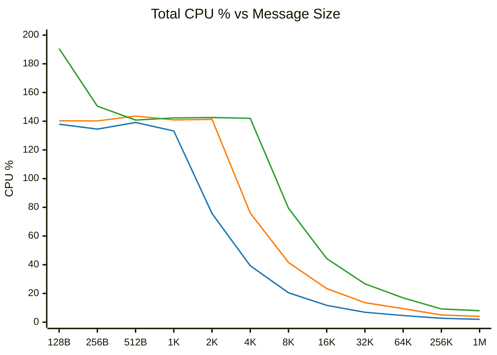

<div align="center">
  
</div>

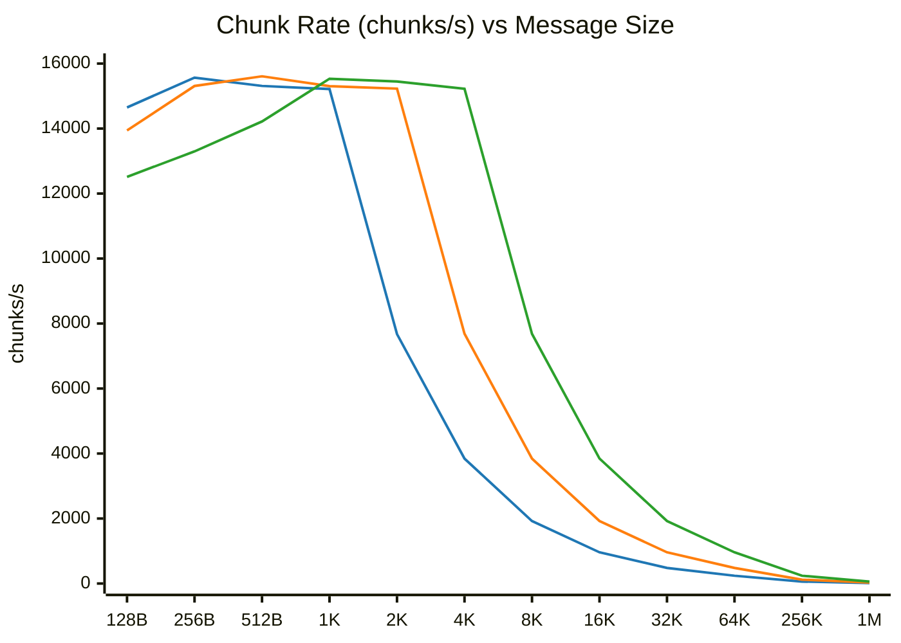

<div align="center">
  
</div>

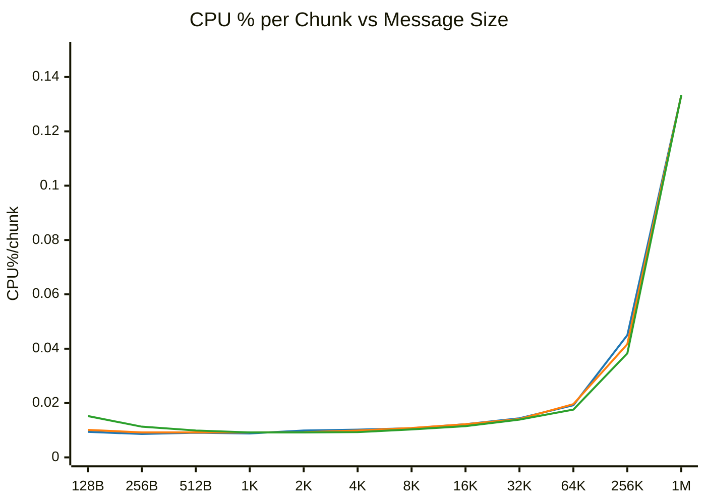

<div align="center">
  
</div>

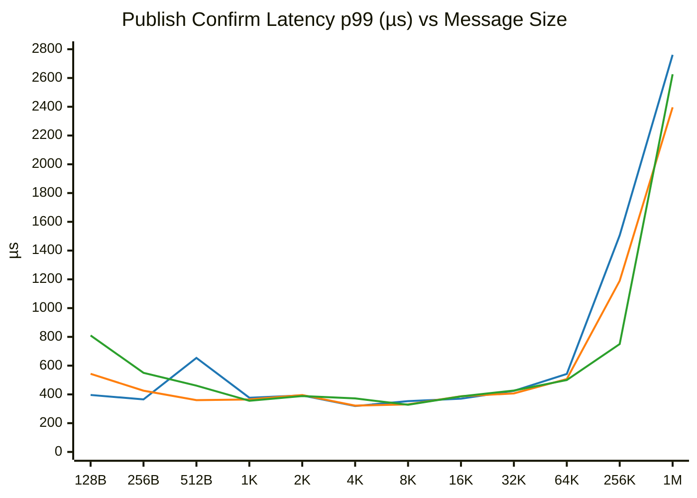

<div align="center">
  
</div>

## Interpretation

At fixed byte throughput, message size determines which cost regime dominates. The system has two additive cost components: a per-chunk fixed cost and a per-byte variable cost.

**Chunk rate ceiling**: with a single producer, the writer creates at most 15,300-15,500 chunks/s regardless of throughput level. This ceiling is the maximum frequency at which one producer can send messages to the writer. The ceiling is throughput-independent, but can be increased by adding more producers (see [Multiple producers](#multiple-producers) below).

**Crossover point**: the crossover between ceiling-bound and chunk-rate-proportional operation occurs at: `crossover_size = throughput / ceiling_rate`. At 15 MiB/s: 1 KiB. At 30 MiB/s: 2 KiB. At 60 MiB/s: 4 KiB. Below the crossover, the producer is faster than the writer can create chunks. The writer batches multiple messages per chunk and operates at the ceiling. CPU is flat at 135-145% regardless of message rate. Above the crossover, chunk rate equals message rate and CPU scales proportionally downward.

**CPU per chunk**: in the ceiling region, CPU%/chunk is ~0.009 across all throughput levels, a fixed cost per chunk. Above the crossover, CPU%/chunk rises with message size as per-byte costs (CRC32, page cache write) accumulate. At 1 MiB, CPU%/chunk is ~0.133, 15 times higher than the fixed cost, reflecting the dominance of per-byte work at large message sizes.

**Connection process bottleneck**: At very high message rates (60 MiB/s, 128 B = 491,520 msg/s), the chunk rate drops below the ceiling (12,513 vs 15,500) and CPU rises above 190%. The bottleneck shifts from the writer to `rabbit_stream_reader`, which cannot parse and dispatch messages fast enough. This is a separate ceiling, the connection process's message parsing throughput, that becomes relevant only at extreme message rates.

**Confirm latency**: publish confirm p99 is flat at ~300-550 µs across message sizes from 128 B through 64 KiB at all throughput levels. This flatness is explained by the network round-trip floor (alice -> bob -> alice) masking the server-side variation. Latency rises only at 256 KiB+ where chunk cycle time exceeds the network floor.

The reason that the CPU cost is higher at lower message rates is that the writer is completing batches as quickly as possible. This is good for latency: chunks become confirmed and readable as fast as possible. But it drives up CPU cost. The confirm latency is nearly flat at lower message sizes, but confirm latency is tracked entirely by the caller, so most of the time is spent in fixed hops like network rather than a result of chunk write latency. Adding a delay to gather more messages in a chunk is not straightforward, unfortunately, because we would need microsecond resolution and Erlang `receive`/`after` waits in terms of milliseconds.

Since the Erlang VM uses cooperative scheduling, a system under more load might actually batch more efficiently. With CPU at 100%, a writer would take longer to be scheduled and would then have a larger batch to write, and larger batches are more efficient to write.

> [!TIP]
> Erlang uses zlib for primitives like CRC32 and zlib can be compiled to take advantage of the native CRC32 instructions available in Graviton processors. This significantly reduces CRC32 costs.

> [!NOTE]
> These tests did not use zlib compiled with hardware CRC32.

### Flame graphs

The blog post [Improving RabbitMQ Performance with Flame Graphs](https://www.rabbitmq.com/blog/2022/05/31/flame-graphs) shows the methodology for collecting `perf` data and generating the flagmegraph using the Perl scripts from [CPU Flame Graphs](https://www.brendangregg.com/FlameGraphs/cpuflamegraphs.html). Also see Erlang/OTP's [documentation](https://www.erlang.org/doc/apps/erts/beamasm.html#flame-graph) about flame graphs. Here are the flamegraphs from 30 second samples from the 1 KiB, 64 KiB and 256 KiB sections of the script at 30 MiB/sec ingress, running `bob` with `+JPperf true`:

<details><summary>1 KiB messages flame graph ...</summary>

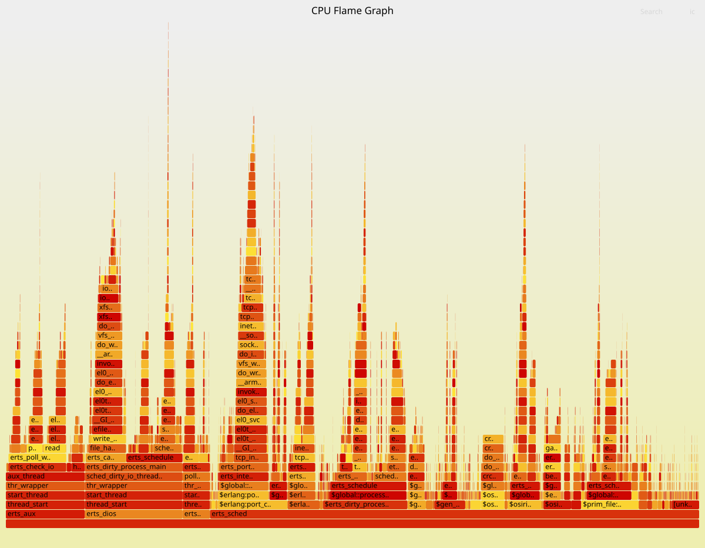

</details>

<details><summary>64 KiB messages flame graph ...</summary>

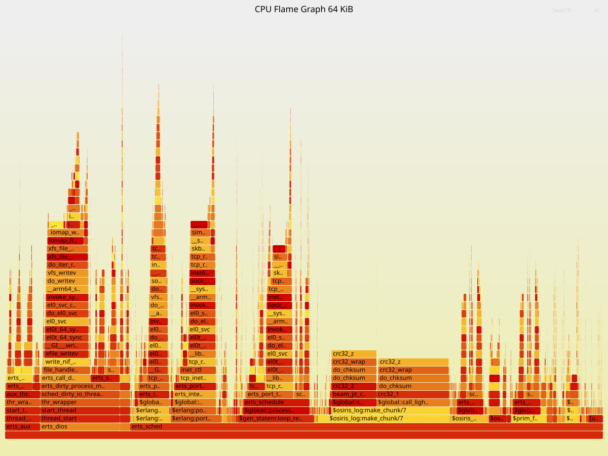

</details>

<details><summary>256 KiB messages flame graph ...</summary>

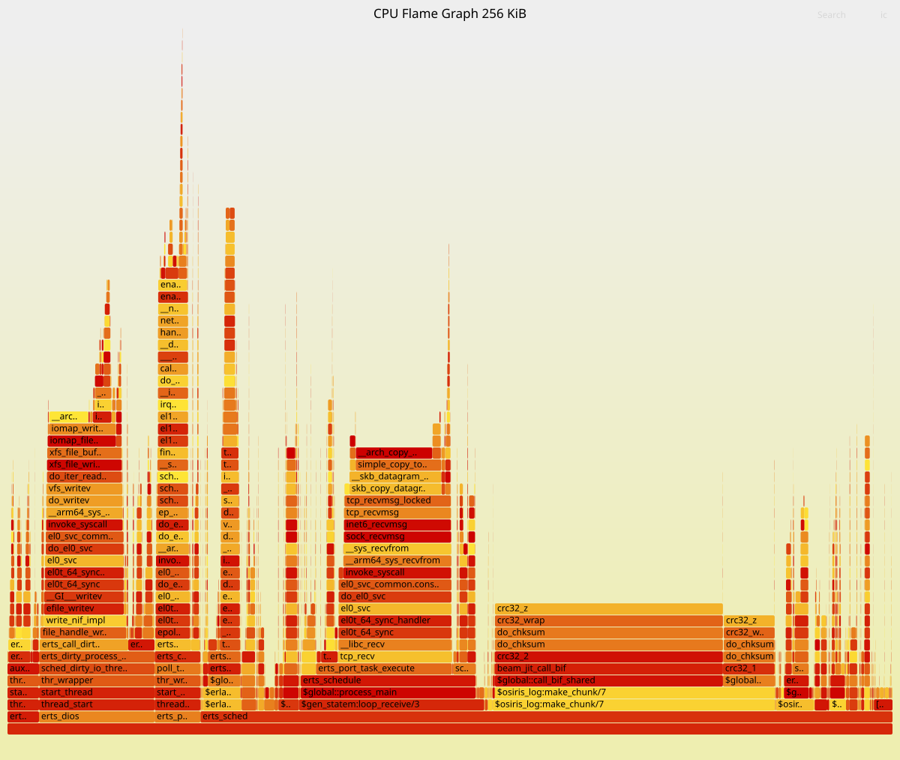

</details>

Comparing the non-trivially-sized spans in the flame graphs:

| Function                           | 1 KiB  | 64 KiB | 256 KiB |
|------------------------------------|-------:|-------:|--------:|
| `$osiris_log:make_chunk/7`         |  3.40% | 20.91% |  31.90% |
| CRC32 (`crc32_z`/`do_chksum`)      | ~9%    |~34%    | ~51%    |
| `sched_dirty_io_thread_func`       | 14.11% | 14.85% |  13.06% |
| `write_nif_impl`                   |  4.97% |  8.64% |   9.31% |
| `$prim_file:write/2`               |  8.29% |  0.91% |         |
| `$erlang:port_command/3` (confirms)|~17%    | ~6.4%  |   4.37% |
| `$gen_statem:loop_receive/3`       |  4.46% | 11.82% |  20.92% |
| `tcp_recv`+`skb_copy_datagram_iter`|        | ~7.75% |    ~23% |
| `erts_sched` (idle)                |        | 75.97% |  78.20% |

Observations:

* Dirty IO thread cost (~14%) is stable across all sizes. It scales with chunk rate, which is proportional to total CPU at fixed byte throughput.
* CRC32 grows from ~9% to ~51% as message size increases. It is byte-proportional and dominates at large messages with software CRC32.
* Publish confirms (`port_command`) drop from around 17% to 4% as chunk rate falls.
* `gen_statem` overhead grows as a fraction as the broker becomes more idle.

### CPU improvement: index files

If we comment out the writing of index files, we can see that CPU cost drops significantly. Comparing the 30 MiB/sec section of the script:

| Size    | CPU% baseline | CPU% no-index | reduction | chunk rate baseline | chunk rate no-index |
|---------|--------------:|--------------:|----------:|--------------------:|--------------------:|
| 128 B   |        138.6  |         117.5 |     15.2% |              14,030 |              17,493 |
| 256 B   |        138.5  |         103.1 |     25.6% |              14,184 |              14,890 |
| 512 B   |        142.2  |         103.8 |     27.0% |              15,573 |              15,593 |
| 1 KiB   |        140.0  |         102.8 |     26.6% |              15,503 |              15,485 |
| 2 KiB   |        139.7  |          92.7 |     33.6% |              15,195 |              14,884 |
| 4 KiB   |         72.1  |          50.6 |     29.8% |               7,653 |               7,688 |
| 8 KiB   |         38.8  |          26.8 |     30.9% |               3,841 |               3,845 |
| 16 KiB  |         22.5  |          16.7 |     25.8% |               1,923 |               1,923 |
| 32 KiB  |         14.2  |          10.5 |     26.1% |                 961 |                 961 |
| 64 KiB  |          9.0  |           7.8 |     13.3% |                 480 |                 480 |
| 256 KiB |          4.8  |           4.5 |      6.3% |                 120 |                 120 |
| 1 MiB   |          3.8  |           3.9 |     -2.6% |                  30 |                  30 |

This is not realistic as the index file needs to be written at some point in order to make lookup efficient. But the writer could wait a number of chunks or on a timer before writing index records to reduce overhead. Even longer term, the writer could coalesce the requests with `io_uring(7)` so that both writes are done in one syscall.

## Multiple producers

We can send the same number of messages from multiple producers

| producers | msg/s  | chunks/s | msgs/chunk | avg chunk B | total CPU% | confirm p99 µs |
|----------:|-------:|---------:|-----------:|------------:|-----------:|---------------:|
|         1 | 30,315 |   15,402 |        2.0 |       2,150 |      141.6 |            346 |
|         2 | 29,879 |   19,059 |        1.6 |       1,721 |      209.6 |            475 |
|         4 | 29,929 |   19,491 |        1.5 |       1,684 |      220.7 |            473 |
|         8 | 30,013 |   19,679 |        1.5 |       1,668 |      220.3 |            441 |

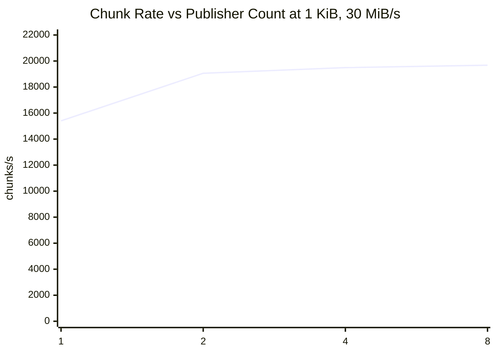

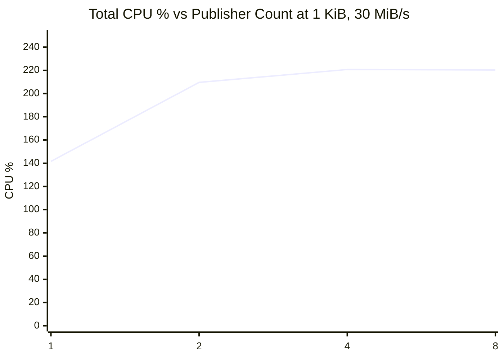

At two producers, the stream writer process becomes the bottleneck. The time it takes to complete a single chunk then limits the ceiling to just under 20,000 chunks/s. After this point, increasing producer count does not change chunk size much.

## Client-side batching

Clients can send batches of messages to RabbitMQ and optionally compress the batch before sending. This is a feature in the stream client libraries. Producers can delay for a configurable time to build batches and then send all data effectively as one or more combined messages. This is conceptually like sending fewer larger messages, so sending the same number of messages in client-side batches decreases chunk rate and CPU usage. This is an effective way to decrease CPU usage for workloads with smaller messages, but it increases latency.

| batch size | delay | chunks/s | total CPU% | confirm p99 µs |
|-----------:|------:|---------:|-----------:|---------------:|
|          1 |  1 ms |   14,473 |      128.4 |            399 |
|          1 | 10 ms |   15,304 |      134.4 |            408 |
|          1 |100 ms |   13,651 |      127.8 |            391 |
|          4 |  1 ms |    2,492 |       28.9 |            835 |
|          4 | 10 ms |    1,985 |       25.5 |            851 |
|          4 |100 ms |    1,958 |       25.1 |            854 |
|         16 |  1 ms |      929 |       13.8 |          1,491 |
|         16 | 10 ms |      199 |        6.0 |          8,897 |
|         16 |100 ms |      131 |        5.3 |          8,897 |
|         64 |  1 ms |      926 |       13.6 |          1,491 |
|         64 | 10 ms |      103 |        4.6 |         10,977 |
|         64 |100 ms |       26 |        4.7 |        105,294 |

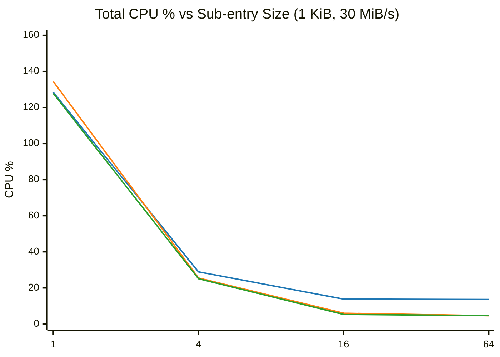

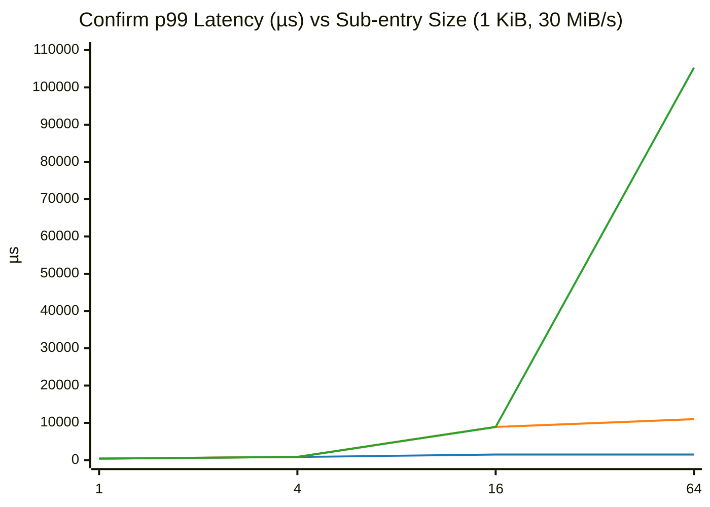

<div align="center">
    <i>Blue: 1ms delay &nbsp; Orange: 10ms delay &nbsp; Green: 100ms delay</i>
</div>

For this total throughput (30 MiB/s) and message size (1 KiB), this data makes a Pareto frontier with a few solutions which cater towards different use-cases.

| operating point        | CPU%  | confirm p99 | use case
|------------------------|------:|------------:|----------
| baseline (no batching) | ~140% | ~350 µs     | latency-critical
| batch-size 4, 1ms      | ~29%  | ~835 µs     | balanced
| batch-size 16, 1ms     | ~14%  | ~1,491 µs   | throughput-oriented, <2ms tolerance
| batch-size 16, 10ms    | ~6%   | ~9 ms       | bulk ingest, <10ms tolerance
| batch-size 64, 10ms    | ~5%   | ~11 ms      | bulk ingest, <15ms tolerance
